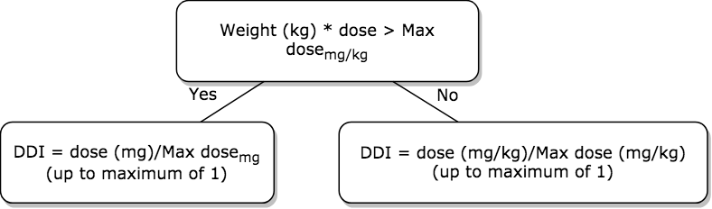
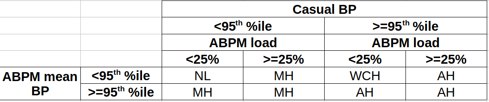

```{r setup, include=FALSE}
knitr::opts_chunk$set(echo = TRUE,results='asis')
Sys.setenv(RSTUDIO_PANDOC='/usr/local/bin/pandoc')
```
# Do higher cumulative antihypertensive doses result in better blood pressure (BP) control in children with chronic kidney disease (CKD)?

## Background
Hypertension is a major risk factor for CKD progression as well as cardiovascular and neurocognitive comorbidities. The prevalence of uncontrolled hypertension in children with CKD is high, despite a majority of whom are taking antihypertensive medications. A recent study of the pediatric CKD population by Barletta, et al (2017) demonstrated the increasing prevalence of masked hypertension over the last 10 years in the CKiD study cohort, suggesting undertreatment. To our knowledge, no studies have examined the influence of antihypertensive dosing on BP control in the pediatric CKD population. This study proposes a new method to quantitatively analyze the cumulative dose of antihypertensive medications and its effect on blood pressure control. In addition, recently published BP percentiles (AAP 2017) were used in determining BP classification used for the analysis.

### Definition of Drug Dose Index (DDI)
* The DDI is a property of every drug dose and depends on
  + the medication
  + the maximum dose based on the patient's age, weight and eGFR
* The DDI is the ratio of the patient's dose to the maximum dose appropriate for that patient, up to a value of 1


#### cumulative DDI = sum of all DDI for each agent taken by the patient

## Objective
To determine the role of antihypertensive dosing, as defined by the cumulative DDI, on BP control in children with CKD.
LVMI percentile as a measure of target organ damage from chronic hypertension, was also evaluated as a secondary outcome to determine its relationship with cummulative DDI.

## Hypothesis
If hypertension is undertreated due to inadequate dose of BP medications, patients with hypertension and LVH will have the same or lower cumulative doses compared to those with normal blood pressure.

## Methods
This study is a retrospective analysis of data obtained from the CKiD database via public request from the NIDDK. The third visit was used for the analysis, which is the first visit including physical exam, ambulatory blood pressure monitor (ABPM), echocardiogram, and patient medications.
* systolic and diastolic BP percentiles were calculated based on the methods published in Rosner B, et al. (2008). BP z-score was determined from BP percentile using the quantile function.
+ BP classification was then determined based on casual BP and ambulatory blood pressure monitoring study results, as described by Samuels, J et al (2009), and shown below

**NL = normal BP, WCH = white-coat hypertension, MH = masked hypertension, AH = ambulatory hypertension**

* LVMI percentile was calculated based on normative tables published by Khoury PR, et al (2009).
+ LVH was defined as those with LVMI >= 95th percentile
* Patient characteristics were also considered as possible covariates:
+ number of BP agents at baseline visit
+ age (years)
+ sex
+ race
+ CKD stage
+ eGFR based on full CkiD gfr equation
   $$ eGFR = 39.8 \times \left ( \frac{ht(m)}{Scr} \right )^{0.456} \times \left( \frac{1.8}{cysC} \right )^{0.418}\times \left ( \frac{30}{BUN} \right )^{0.079}\times 1.076^{male}\times \left ( \frac{ht(m)}{1.4} \right )^{0.179} $$
+ time of CKD onset (yrs)
+ Primary CKD diagnosis (glomerular or non-glomerular)
+ Degree of proteinuria (urine protein:creatinine ratio (mg/mg Cr), and categorical (normal;mild;moderate;severe))
+ BMI z-score
+ total household income

* due to positively skewed distribution of cumulative DDI, all statistical tests were performed on ln(cumulative DDI).
* all group comparisons report mean(SD) for cumulative DDI
* p-values are based on
  + t-test for dichotomous factors (eg, sex - male or female)
  + ANOVA for factors with >2 levels (eg, CKD stage 2-5)
  + chi-square test when both variables are categorical

### The study population
#### Inclusion criteria
* entered into CKiD study
* taking at least *one* antihypertensive medication
* measured BP
* known age, gender and height
* successful ABPM study

   
#### Exclusion criteria
* missing BP medication details:
  + daily dose
  + daily frequency
  + weight
* white-coat hypertension (n=5)

## Results

### Study population characteristics (n=255)
```{r study population, message=FALSE,echo=FALSE}
load("test3.RData", verbose = TRUE)
#loading libraries
library(readr)
library(corrplot)
library(dplyr)
library(reshape2)
library(histogram)
library(gplots)
library(tidyr)
library(stats)
library(tibble)
library(ggplot2)
library(summarytools)
library(data.table)
library(ggpubr)
library(kableExtra)
library(RColorBrewer)
library(rmarkdown)
combo_cases<-medsum_full.old %>% filter(VISIT==20,length(grep("\\/",med.corrected)!=0L)) %>% ungroup() %>% select(CASEID) %>% unique() %>% unlist() %>% as.numeric()
cases<-test %>% filter(!CASEID %in% combo_cases,VISIT==20, n_agents>0,!is.na(sum_DDI),ABPMSUCCESS==1,!BPclass.factor=="WCH",!is.na(BUN), !is.na(CYC_DB),!is.na(SCR),!is.na(AVHEIGHT), !is.na(AVWEIGHT), !is.na(BPstatus2017)) %>% ungroup() %>%select(CASEID) %>% unique %>% unlist %>% as.numeric()# exclude those taking combo medications
test.cohort<-test %>% filter(VISIT==20, CASEID %in% cases)

test.cohort$BMI.factor<-cut(test.cohort$BMIPCTAG,c(0,5,85,95,Inf),right=FALSE,ordered_result = TRUE,labels=c("Underweight","Normal weight","Overweight","Obese+Severely Obese"))
test.cohort<-test.cohort %>% mutate(sum_DDI.ln=log(sum_DDI))
test.cohort$age.factor<-cut(test.cohort$age,c(0,10,13,16,Inf), right=TRUE,ordered_result = TRUE)
```
```{r Table 1: Overall population summary,echo=FALSE}

dfSummary(plain.ascii= FALSE,style = "grid",test.cohort %>% select(age,age.factor,MALE1FE0,CKD_stage,CKDONST,n_agents,BPclass.factor,SBPZAGH2017,DBPPCTAGH2017, LVMIp,Upc,Upc.factor,BMIz,BMI.factor,GNGDIAG,GHTOTINC,RACE,sum_DDI))
```


### 1) Overall summary (all patients, n=255)
```{r, generate results: Overall, message=FALSE,echo=FALSE}
library(dplyr)
library(knitr)
q<-data.table(test.cohort)
setkey(q,BPclass.factor)
q<-q[, list(Avg=mean(sum_DDI),SD=sd(sum_DDI),Min=min(sum_DDI),Max=max(sum_DDI),"Mean BP agents"=mean(n_agents),N=.N),by="BPclass.factor"]
q[, Avg := format(Avg, digits = 2)]
q[, SD := format(SD, digits = 2)]
q[, Min := format(Min, digits = 2)]
q[, Max := format(Max, digits = 2)]
q[, `Mean BP agents` := format(`Mean BP agents`, digits = 3)]
```
```{r Table 2: Cumulative DDI summary: overall, results='asis',echo=FALSE}
kable(q,format="html",caption="Summary: all patients (n=255)", align=rep('c',7))
```
#### Compare cumulative DDI between different BP status groups
```{r Figure 1: compare means (overall),results='asis',echo=FALSE}
my_comparisons=list(c("NL","AH"))
p<-ggboxplot(test.cohort,x="BPclass.factor",y="sum_DDI.ln", color="BPclass.factor",palette="npg",add="jitter")
p+
  labs(title="Cummulative DDI by BP status (Overall, n=255)",
       subtitle="NL=Normal BP, MH=Masked HTN,AH=Ambulatory HTN\nNote: ln(cummulative DDI) used for analysis",
       caption="comparison: t-test, p-value shown refers to NL vs AH",
       x="BP status",
       y="ln(cummulative DDI)")+
  stat_compare_means(comparisons=my_comparisons, method="t.test")+
   coord_cartesian(ylim = c(-4,1.8))
```
```{r statistical tests: Overall,echo=FALSE}
q<-compare_means(sum_DDI.ln~BPclass.factor,test.cohort, method="t.test")[,-c(4,5)]
q2<-compare_means(sum_DDI.ln~BPclass.factor,test.cohort, method="anova")[,-c(2,3)] %>% data.table
```
```{r Tables 2,3: show statistical results: Compare cumulative DDI (Overall),echo=FALSE}
kable(q,format="html",caption="Comparisons between BP status: Overall (n=255)", align=rep('c',6))
kable(q2,format="html",caption="Comparisons between BP status: Overall (n=255)", align=rep('c',4))
```
#### Interpretation:
* The cumulative DDI is significantly lower in the NL vs AH group
  + mean(SD) = 0.5(0.5) vs 0.78(0.6), p=0.04
* ANOVA: Comparing mean cumulative DDI between all groups, p-value = 0.053
* The average cumulative DDI of the MH group does not significantly differ from either the NL or the AH group, however is closer to the NL group
  + This may suggest undertreatment, in terms of antihypertensive dosing, in the MH group vs the NL group
  
### 2) Subgroup: Primary CKD diagnosis: Non-glomerular only, n=164 (Cumulative DDI by BP status)
```{r, generate results: Subgroup - Primary CKD diagnosis (non-glomerular),message=FALSE,echo=FALSE}
q<-test.cohort %>% filter(GNGDIAG>2) %>% data.table()
setkey(q,BPclass.factor)
q<-q[, list(Avg=mean(sum_DDI),SD=sd(sum_DDI),Min=min(sum_DDI),Max=max(sum_DDI),"Mean BP agents"=mean(n_agents),N=.N),by=BPclass.factor]
q[, Avg := format(Avg, digits = 2)]
q[, SD := format(SD, digits = 2)]
q[, Min := format(Min, digits = 2)]
q[, Max := format(Max, digits = 2)]
q[, `Mean BP agents` := format(`Mean BP agents`, digits = 3)]
```
```{r Table 4: Subgroup summary: non-glomerular, results='asis',echo=FALSE}
kable(q,format="html",caption="Subgroup Summary (non-glomerular): cumulative DDI", align=rep('c',7))
```
#### Subgroup (non-glomerular): Compare cumulative DDI between different BP status groups
```{r Figure 2: compare means (non-glomerular only),echo=FALSE,results='asis',echo=FALSE}
p<-ggboxplot(test.cohort %>% filter(GNGDIAG>2),x="BPclass.factor",y="sum_DDI.ln", color="BPclass.factor",palette="npg",add="jitter")
p+
  labs(title="Subgroup (non-glomerular): Cummulative DDI by BP status",
       subtitle="NL=Normal BP, MH=Masked HTN,AH=Ambulatory HTN\nNote: ln(cummulative DDI) used for analysis",
       caption="p>0.05 for all comparisons",
       x="BP status",
       y="ln(cummulative DDI)")
  #coord_cartesian(ylim = c(-4,1.8))
```

```{r Tables 5,6: show statistical results: Compare cumulative DDI (non-glomerular),echo=FALSE}
kable(compare_means(sum_DDI.ln~BPclass.factor,test.cohort %>% filter(GNGDIAG>2), method="anova")[,-c(2,3)],format="html",caption="Comparisons between BP status: non-glomerular (n=164)", align=rep('c',6))
kable(compare_means(sum_DDI.ln~BPclass.factor,test.cohort %>% filter(GNGDIAG>2), method="t.test")[,-c(4,5)],format="html",caption="Comparisons between BP status: non-glomerular (n=164)", align=rep('c',6))
```
#### Interpretation:
* The cumulative DDI similar among all BP status groups. This suggests a possible opportunity to improve BP control in the non-glomerular group with hypertension.

### 3) Subgroup: BMI categories (Cumulative DDI by BP status)
#### (Underweight=0-5th %ile, Normal=5-85th %ile, Overweight=85-95th %ile, Obese+Severely Obese>95th %ile)
```{r, generate results: Subgroup - BMI category,message=FALSE,echo=FALSE,results='asis'}
q<-data.table(test.cohort)
setkey(q,BMI.factor,BPclass.factor)
q<-q[, list(Avg=mean(sum_DDI),SD=sd(sum_DDI),Min=min(sum_DDI),Max=max(sum_DDI),"Mean BP agents"=mean(n_agents),N=.N),by=c("BMI.factor","BPclass.factor")]
q[, Avg := format(Avg, digits = 2)]
q[, SD := format(SD, digits = 2)]
q[, Min := format(Min, digits = 2)]
q[, Max := format(Max, digits = 2)]
q[, `Mean BP agents` := format(`Mean BP agents`, digits = 3)]
```
```{r Table 7: Subgroup summary: BMI categories, results='asis',echo=FALSE}
kable(q,format="html",caption="Subgroup Summary (BMI categories): cumulative DDI",align=c('l',rep('c',6))) %>% column_spec(1,width="15em") %>%column_spec(3:8,width="5em")
```
#### Subgroup (BMI categories): Compare cumulative DDI between different BP status groups within BMI categories
```{r Figure 3: compare means (BMI categories),echo=FALSE,results='asis'}
p<-ggboxplot(test.cohort %>% filter(BMI.factor!="Underweight"),color="BPclass.factor",x="BMI.factor",y="sum_DDI.ln",palette="npg",add="jitter")
p+
  labs(title="Subgroup (BMI categories): Cummulative DDI by BP status, grouped by BMI category",
       subtitle="Normal weight=5-85th %ile, Overweight=85-95th %ile, Obese+Severely Obese>95th %ile",
       caption="Overweight: NL vs AH, p=0.04",
       x="BP status",
       y="ln(cummulative DDI)")+
  coord_cartesian(ylim = c(-4,1.8))
```

```{r Tables 8,9: show statistical results: Compare cumulative DDI (within BMI categories),echo=FALSE}
kable(compare_means(sum_DDI.ln~BPclass.factor,test.cohort %>% filter(BMI.factor!="Underweight"),group.by = "BMI.factor", method="anova")[,-c(3,4)],format="html",caption="Comparisons between BP status: BMI categories", align=c('l',rep('c',4)))
kable(compare_means(sum_DDI.ln~BPclass.factor,test.cohort %>% filter(BMI.factor!="Underweight"),group.by = "BMI.factor", method="t.test")[,-c(5,6)],format="html",caption="Comparisons between BP status: BMI categories", align=c('l',rep('c',6)))
```
#### Interpretation:
* There are no signfificant differences in cumulative DDI by BP status among all BMI categories, except for:
  + Among *overweight* children, the average cumulative DDI is significantly higher in the AH vs NL group
    + mean(SD) = 0.86(0.31) vs 0.42(0.31), p=0.04

### 3) Subgroup: CKD stages (Cumulative DDI by BP status)
```{r, generate results: Subgroup - CKD stages,message=FALSE,echo=FALSE,results='asis'}
q<-data.table(test.cohort)
setkey(q,CKD_stage,BPclass.factor)
q<-q[, list(Avg=mean(sum_DDI),SD=sd(sum_DDI),Min=min(sum_DDI),Max=max(sum_DDI),"Mean BP agents"=mean(n_agents),N=.N),by=c("CKD_stage","BPclass.factor")]
q[, Avg := format(Avg, digits = 2)]
q[, SD := format(SD, digits = 2)]
q[, Min := format(Min, digits = 2)]
q[, Max := format(Max, digits = 2)]
q[, `Mean BP agents` := format(`Mean BP agents`, digits = 3)]
```

```{r Table 10: Subgroup summary: CKD stages, results='asis',echo=FALSE}
kable(q,format="html",caption="Subgroup Summary (CKD stages): cumulative DDI",align=c('l',rep('c',6)))  %>%column_spec(1,width="1em") %>%column_spec(3:8,width="5em")
```
#### 4) Subgroup (CKD stages): Compare cumulative DDI between different BP status groups within each CKD stage subgroup
```{r Figure 4: compare means (CKD stages),echo=FALSE,results='asis'}
p<-ggboxplot(test.cohort %>% filter(CKD_stage!=1),color="BPclass.factor",x="CKD_stage",y="sum_DDI.ln",palette="npg",add="jitter")
p+
  labs(title="Subgroup (CKD stages): Cummulative DDI by BP status, grouped by CKD stage",
       x="CKD stage",
       y="ln(cummulative DDI)")+
  coord_cartesian(ylim = c(-4,1.8))
```
```{r generate statistical results: ,message=FALSE,echo=FALSE,message=FALSE}
q<-compare_means(sum_DDI.ln~BPclass.factor,test.cohort %>% filter(CKD_stage!=1),group.by = "CKD_stage", method="anova")[,-c(3,4)] %>% data.table()
q2<-compare_means(sum_DDI.ln~BPclass.factor,test.cohort %>% filter(CKD_stage!=1),group.by = "CKD_stage", method="t.test")[,-c(5,6)] %>% data.table
setkey(q,CKD_stage)
setkey(q2,CKD_stage)
```

```{r Tables 11,12: show statistical results: Compare cumulative DDI (within CKD stage groups),echo=FALSE}
kable(q,format="html",caption="Comparisons between BP status: CKD stages", align=c('l',rep('c',4)))
kable(q2,format="html",caption="Comparisons between BP status: CKD stages", align=c('l',rep('c',6)))
```
#### Interpretation:
* Although the comparison between NL and AH in CKD stage 5 is statistically significant, there are only 7 and 3 patients in each subgroup, respectively, limiting the interpretation.
* In the CKD stage 4 group, the cumulative DDI in the NL and MH groups are relatively low compared to that of the AH group. The corresponding ANOVA for CKD stage 4 was significant (p=0.024).
  + this may suggest that patients with CKD stage 4 and MH are undertreated
  + alternatively other factors may explain their BP status, despite having similar cumulative DDI to the NL group with CKD stage 4.

### 5) Subgroup: Age groups (Cumulative DDI by BP status)
#### (<10 years old, 10-13 yrs, 13-16yrs, >16yrs)
```{r, generate results: Subgroup - age groups,message=FALSE,echo=FALSE,results='asis'}
q<-data.table(test.cohort)
setkey(q,age.factor,BPclass.factor)
q<-q[, list(Avg=mean(sum_DDI),SD=sd(sum_DDI),Min=min(sum_DDI),Max=max(sum_DDI),"Mean BP agents"=mean(n_agents),N=.N),by=c("age.factor","BPclass.factor")]
q[, Avg := format(Avg, digits = 2)]
q[, SD := format(SD, digits = 2)]
q[, Min := format(Min, digits = 2)]
q[, Max := format(Max, digits = 2)]
q[, `Mean BP agents` := format(`Mean BP agents`, digits = 3)]
```

```{r Table 13: Subgroup summary: age groups, results='asis',echo=FALSE}
kable(q,format="html",caption="Subgroup Summary (age groups): cumulative DDI",align=c('l',rep('c',6))) %>% column_spec(1,width="3em") %>%column_spec(3:8,width="5em")
```

#### 5) Subgroup (age groups): Compare cumulative DDI between different BP status groups within each age subgroup
```{r Figure 5: Compare means (age),echo=FALSE,results='asis'}
p<-ggboxplot(test.cohort,color="BPclass.factor",x="age.factor",y="sum_DDI.ln",palette="npg",add="jitter")
p+
  labs(title="Subgroup (age groups): Cummulative DDI by BP status, grouped by age",
       x="age group",
       y="ln(cummulative DDI)")+
  coord_cartesian(ylim = c(-4,1.8))
```

```{r generate statistical results: Age subgroups,message=FALSE,echo=FALSE,message=FALSE}
q<-compare_means(sum_DDI.ln~BPclass.factor,test.cohort,group.by = "age.factor", method="anova")[,-c(3,4)] %>% data.table()
q2<-compare_means(sum_DDI.ln~BPclass.factor,test.cohort,group.by = "age.factor", method="t.test")[,-c(5,6)] %>% data.table
setkey(q,age.factor)
setkey(q2,age.factor)
```

```{r Tables 11,12: show statistical results: Compare cumulative DDI (within age groups),echo=FALSE}
kable(q,format="html",caption="Comparisons between BP status: age groups", align=c('l',rep('c',4)))
kable(q2,format="html",caption="Comparisons between BP status: age groups", align=c('l',rep('c',6)))
```
#### Interpretation:
* In young kids (3-10yrs), cummulative DDI is significantly higher in AH vs NL and AH vs MH.
* In adolescents (13-16yrs), the findings are similar.
* ANOVA did not show any significant differences in cumulative DDI between age subgroups, based on BP status

### 6) Subgroup: Number of antihypertensive agents (Cumulative DDI by BP status)
```{r, generate results: Subgroup - # BP agents,message=FALSE,echo=FALSE,results='asis'}
q<-data.table(test.cohort)
setkey(q,n_agents,BPclass.factor)
q<-q[, list(Avg=mean(sum_DDI),SD=sd(sum_DDI),Min=min(sum_DDI),Max=max(sum_DDI),N=.N),by=c("n_agents","BPclass.factor")]
q[, Avg := format(Avg, digits = 2)]
q[, SD := format(SD, digits = 2)]
q[, Min := format(Min, digits = 2)]
q[, Max := format(Max, digits = 2)]
```

```{r Table 13: Subgroup summary: # agents, results='asis',echo=FALSE}
kable(q,format="html",caption="Subgroup Summary (# BP agents): cumulative DDI",align=c('l',rep('c',6))) %>% column_spec(1,width="3em") %>%column_spec(3:6,width="4em")
```
#### 6) Subgroup (# BP agents): Compare cumulative DDI between different BP status groups within each stratum
```{r Figure 6: compare means (num BP agents),echo=FALSE,message=FALSE,results='asis'}
p<-ggboxplot(test.cohort ,color="BPclass.factor",x="n_agents",y="sum_DDI.ln",palette="npg",add="jitter")
p+
  labs(title="Subgroup (age groups): Cummulative DDI by BP status, grouped by # antihypertensive agents",
       subtitle="range of # agents: 1-4",
       x="# BP agents",
       y="ln(cummulative DDI)")+
  coord_cartesian(ylim = c(-4,1.8))
```

```{r generate statistical results: # BP agent subgroups,message=FALSE,echo=FALSE,message=FALSE}
test.cohort$n_agents.factor<-factor(test.cohort$n_agents)
#q<-compare_means(sum_DDI.ln~BPclass.factor,test.cohort,group.by = "n_agents.factor", method="anova")[,-c(3,4)] %>% data.table()
q2<-compare_means(sum_DDI.ln~BPclass.factor,test.cohort,group.by = "n_agents.factor", method="t.test")[,-c(5,6)] %>% data.table
#setkey(q,n_agents.factor)
setkey(q2,n_agents.factor)
```

```{r Tables 11,12: show statistical results: Compare cumulative DDI (within groups based on # BP agents),echo=FALSE}
kable(q,format="html",caption="Comparisons between BP status: # BP agents", align=c('l',rep('c',4)))
kable(q2,format="html",caption="Comparisons between BP status: # BP agents", align=c('l',rep('c',6)))
```
#### Interpretation:

#### Subgroup differences based on BP status

```{r subgroup bias evaluation, echo=FALSE,message=FALSE}
chisq.GNGDIAG<-chisq.test(test.cohort$GNGDIAG.factor,test.cohort$BPclass.factor)
BMI.anova<-compare_means(BMIz~BPclass.factor,test.cohort,method="anova")
gfr.anova<-compare_means(gfr~BPclass.factor,test.cohort,method="anova")
age.anova<-compare_means(age~BPclass.factor,test.cohort,method="anova")
n_agents.chisq<-chisq.test(test.cohort$n_agents,test.cohort$BPclass.factor)
```
* The following analysis was done to determine if there are significant differences in the distribution of BP status within each subgroup
  + Primary CKD diagnosis (glomerular vs non-glomerular): chi-squared test, p=`r round(chisq.GNGDIAG$p.value,2)`
  + BMI z-score: ANOVA, p=`r BMI.anova$p.format`
  + eGFR: ANOVA, p=`r gfr.anova$p.format`
  + age (yrs): ANOVA, p=`r age.anova$p.format`
  + num BP agents: chi-squared test, p=`r signif(n_agents.chisq$p.value,2)`
    + There is a strong positive association between BP status and number of BP agents
  